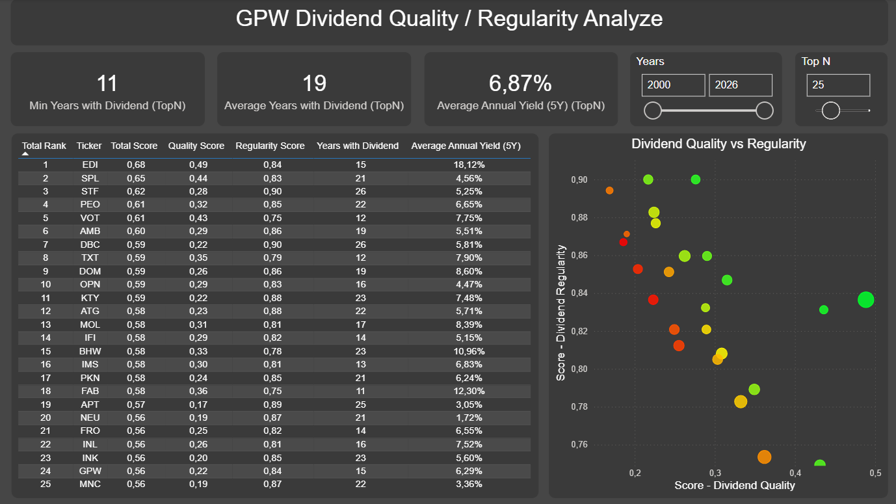
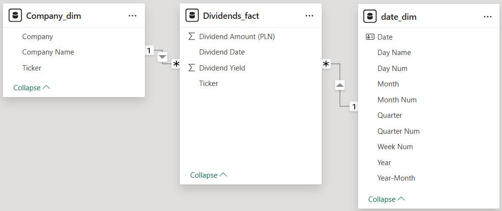
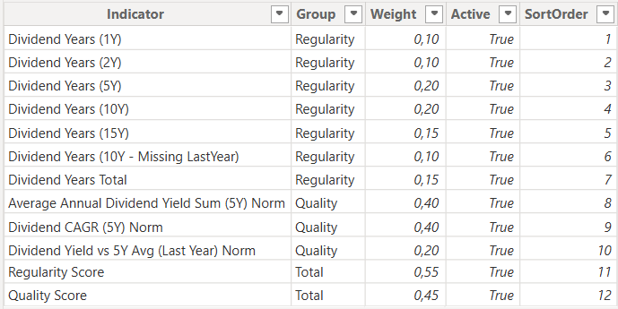
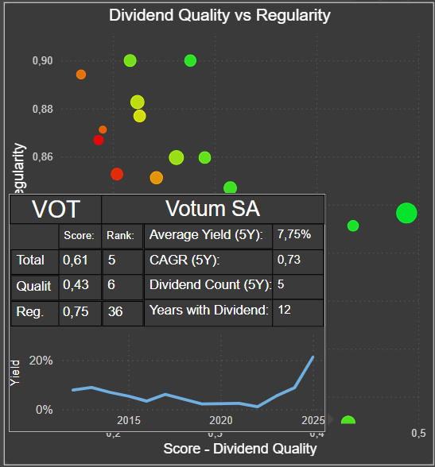

# PowerBI_dywidendy_analiza_jakości_i_regularności

Projekt Power BI prezentujący ranking spółek dywidendowych GPW
oparty na dwóch niezależnych filarach: regularności wypłat
oraz jakości i dynamiki dywidendy.

Dashboard umożliwia dynamiczne zawężanie universe inwestycyjnego
oraz porównanie spółek w różnych horyzontach czasowych.

## Opis projektu



Projekt Power BI stanowi rozwinięcie i kolejny etap analizy danych dywidendowych spółek notowanych na GPW. Jego celem jest wsparcie procesu wyboru najlepszych spółek dywidendowych poprzez połączenie:

- długoterminowej regularności wypłat dywidendy

- jakości i dynamiki dywidendy (yield, CAGR, stabilność)

- elastycznej analizy w czasie (dynamiczny zakres lat)

Dashboard umożliwia interaktywną analizę, rankingowanie i porównywanie spółek, a wszystkie obliczenia realizowane są w DAX na podstawie modelu danych przygotowanego wcześniej w Power Query.

## Zakres danych

- Spółki notowane na GPW

- Historia dywidend od 2000 roku do ostatniego kompletnego roku

- Dane źródłowe przygotowane i oczyszczone w Power Query

- Model danych w układzie gwiazdy:

    - Dividend_fact

    - Company_dim

    - date_dim

## Model danych



Model danych został zaprojektowany w oparciu o schemat gwiazdy (star schema) w sposób umożliwiający:

- analizę czasową (Year slicer)

- agregacje i obliczenia miar

- dynamiczne rankingi i filtry Top N

Relacje:

- Dividend_fact → Company_dim (Ticker)

- Dividend_fact → date_dim (Data)

## Logika analityczna

Logika scoringu została zaprojektowana tak, aby oddzielnie oceniać
stabilność historyczną dywidendy oraz jej jakość i dynamikę,
a następnie łączyć je w jeden wynik końcowy. 
Analiza opiera się na dwóch głównych filarach, które są liczone i oceniane niezależnie:

**1. Regularność dywidendy (Dividend Regularity)**

Wskaźniki mierzą stabilność historyczną wypłat, m.in.:

- liczba lat z dywidendą (1Y, 2Y, 5Y, 10Y, 15Y)

- brak dywidendy w ostatnim roku przy zachowanej ciągłości wcześniej

- łączna liczba lat z dywidendą w całym zbiorze

Wszystkie wskaźniki zostały:

- przeskalowane do zakresu 0–1

- zagregowane do Regularity Score z wykorzystaniem wag

**2. Jakość dywidendy (Dividend Quality)**

Wskaźniki jakości bazują na ostatnich 5 latach:

- Average Annual Dividend Yield Sum (5Y)

- Dividend CAGR (5Y)

- Dividend Yield vs 5Y Average (Last Year)

Ze względu na różne skale wartości:

- zastosowano normalizację min–max

- zakresy ustalone świadomie (z zabezpieczeniem przed ekstremami)

- brakujące wartości (np. brak CAGR) są obsługiwane logicznie

Wyniki agregowane są do Quality Score.

## Normalizacja i wagi

Celem normalizacji jest umożliwienie łączenia wskaźników
o różnych skalach w jeden spójny system punktowy.

- Normalizacja wykonywana jest na poziomie miar DAX

- Wskaźniki regularnościowe zostały znormalizowane bezpośrednio w miarze:

```dax
Dividend Years (5Y) = 
VAR MaxYear =[Last Complete Year]
VAR Years = 5
RETURN
COUNTROWS(
    FILTER(
        VALUES(date_dim[Year]),
        date_dim[Year] > MaxYear - Years &&
        date_dim[Year] <= MaxYear &&
        CALCULATE(COUNTROWS(Dividends_fact)) > 0
    )
)/Years
```

- Wskaźniki jakościowe posiadają:

    - osobną miarę RAW

    - osobną miarę znormalizowaną

```dax
Miara RAW

Dividend CAGR (5Y) = 
VAR MaxYear = [Last Complete Year]
VAR Years = 5

VAR DataYears = 
    FILTER(
        VALUES(date_dim[Year]),
        date_dim[Year] > MaxYear - Years &&
        date_dim[Year] <= MaxYear &&
        CALCULATE([Dividend Yield (Year)]) > 0
    )
VAR LastYear = MAXX(DataYears,date_dim[Year])
VAR FirstYear = MINX(DataYears,date_dim[Year])
VAR YearsCount = COUNTROWS(DataYears)

VAR StartYield = 
    CALCULATE(
        [Dividend Yield (Year)],
        date_dim[Year] = FirstYear
    )
VAR EndYield =
    CALCULATE(
        [Dividend Yield (Year)],
        date_dim[Year] = LastYear
    )

VAR NumYears = LastYear - FirstYear

RETURN 
IF(
    YearsCount >= 3 &&
    StartYield > 0 && 
    EndYield > 0 && 
    NumYears > 0, 
    (EndYield/StartYield)^(1/NumYears)-1,
    BLANK()
)
```


```dax
Miara znormalizowana metodą min-max

Dividend CAGR (5Y) Norm = 
VAR Start_Value = [Dividend CAGR (5Y)]
VAR MinVal = -0.5
VAR MaxVal = 1

VAR Clipper = 
    MAX(
        MinVal,
        MIN(MaxVal, Start_Value)
    )
RETURN
IF(
    ISBLANK(Start_Value),
    0,
    DIVIDE(
        Clipper - MinVal,
        MaxVal - MinVal
    )
)
```
- Wagi przechowywane są w dedykowanej tabeli _Dividend_Weights, co umożliwia:

    - łatwą modyfikację scoringu

    - szybkie testowanie alternatywnych scenariuszy



## Scoring i ranking

Na podstawie powyższych wskaźników wyliczane są:

- Regularity Score

- Quality Score

- Total Score (kombinacja dwóch powyższych również z użyciem wag)

Dla każdego poziomu dostępny jest:

- ranking reagujący na filtry i slicery (ALLSELECTED)

## Funkcjonalności dashboardu
### Slicery

- Top N – dynamiczny wybór liczby najlepszych spółek

- Year range – zakres lat używany w analizie (od–do)

### Wizualizacje

- Scatter chart: Quality vs Regularity

    - rozmiar: Average Annual Dividend Yield (5Y)

    - kolor: Total Score (gradient)

- Tabela Top N spółek:

    - Total Rank
    
    - Ticker

    - Total Score

    - Quality Score

    - Regularity Score

    - Years with Dividend

    - Average Annual Yield (5Y)

### KPI

- Min Years with Dividend (TopN)

- Average Years with Dividend (TopN)

- Average Annual Yield (5Y) (TopN)

### Tooltip (rozszerzona analiza)



Dla każdej spółki dostępny jest rozbudowany tooltip zawierający:

- Total / Regularity / Quality Score + Rank

- kluczowe wskaźniki dywidendowe

- wykres historii stopy dywidendy w czasie

Dzięki temu użytkownik może przejść z rankingu do szczegółowej analizy jednej spółki bez opuszczania widoku.

## Cel projektu

Dashboard nie ma na celu wskazywania „jednej najlepszej spółki”, lecz:

- zawężenie universe inwestycyjnego

- porównanie spółek o różnych profilach dywidendowych

- identyfikację kompromisu między stabilnością a wzrostem

Projekt pokazuje:

- praktyczne wykorzystanie DAX

- świadome zarządzanie kontekstem filtrów

- analityczne podejście do scoringu i rankingu

## Technologie

- Power BI

- DAX

- Power Query

- Excel (etap przygotowania danych)